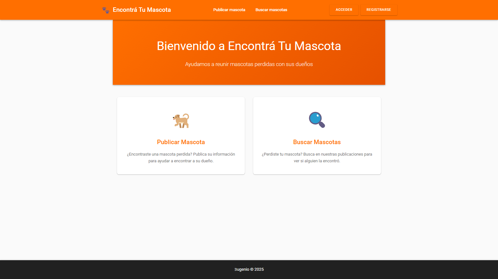
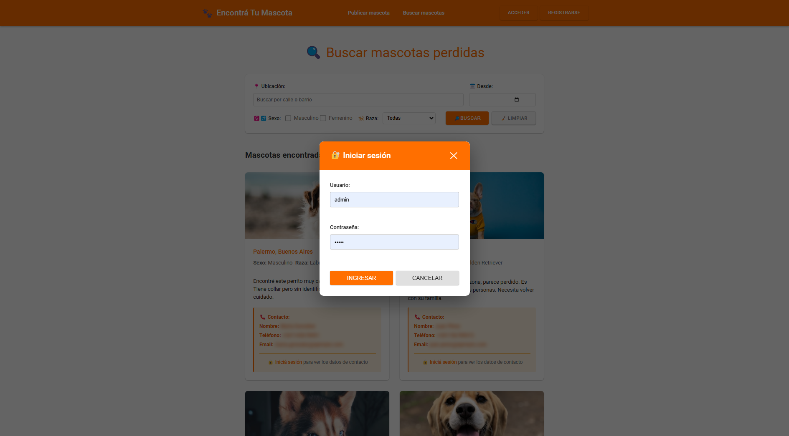
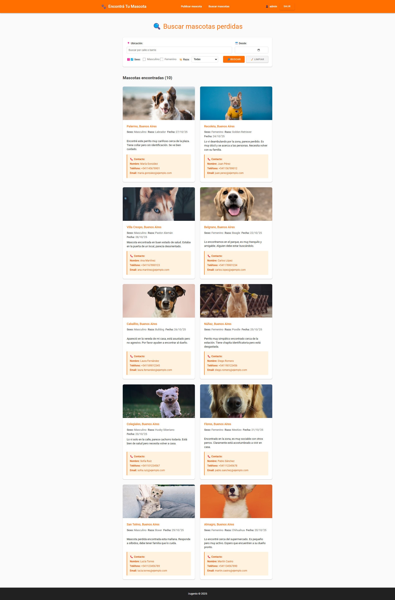
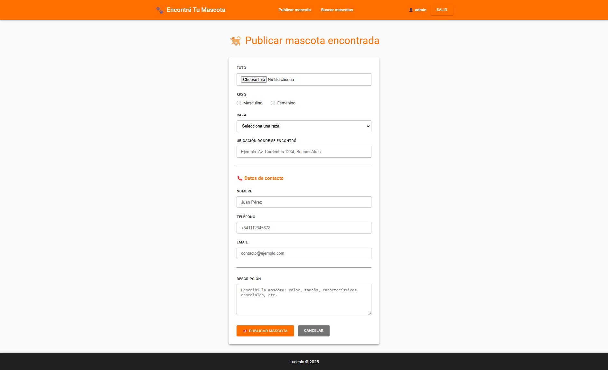

# Programación en Nuevas Tecnologías 1

## Proyecto final 'Encontrá Tu Mascota'
**Plataforma web colaborativa para reunir mascotas perdidas con sus familias**

Backlog: https://github.com/users/eugeniosaintemarie/projects/1/views/1

Azure: https://encontratumascota-h6dvdmdjbqe9a6bw.brazilsouth-01.azurewebsites.net/
https://portal.azure.com/#home

## Demo

### Home (universal)

### Publicaciones (público)

### Log In

### Publicaciones (registrado)

### Carga (registrado)
